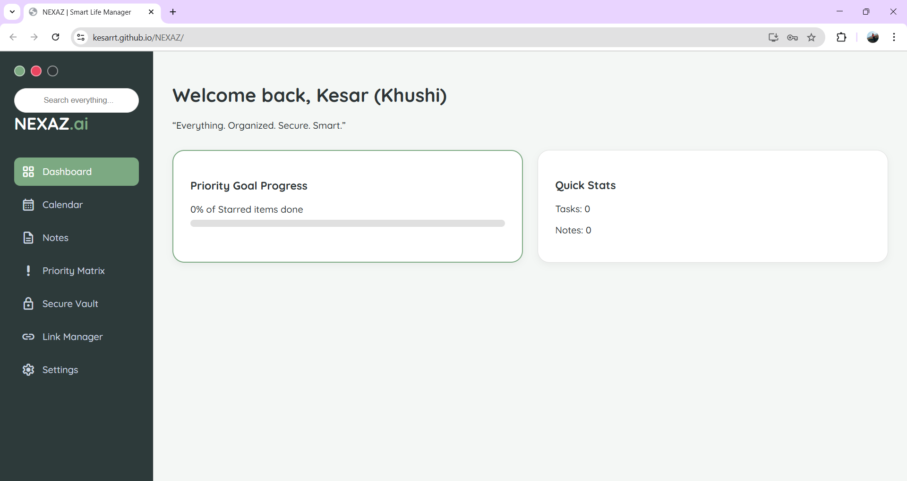
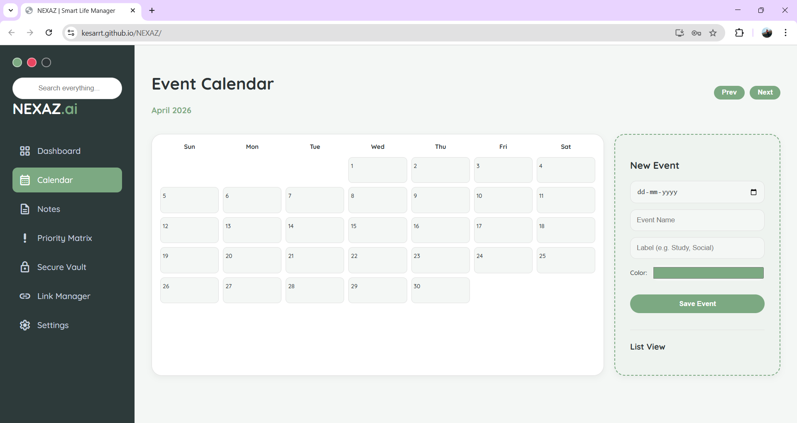
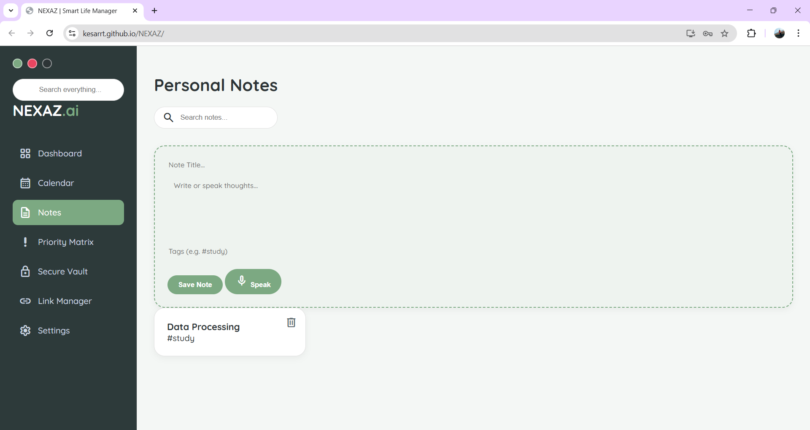

# NEXAZ | Smart Life Manager 🚀

**NEXAZ** is a secure, AI-inspired Personal OS designed for high-performance productivity, secure data storage, and streamlined scheduling. Developed as a final year project for KITS Ramtek.

### 🌐 Live Demo
Access your personal dashboard here:  
👉 **[https://kesarrt.github.io/NEXAZ/](https://kesarrt.github.io/NEXAZ/)**

---

## 📸 App Preview

### 1. The Secure Lock Screen
NEXAZ prioritizes your privacy. The system is protected by a 4-digit PIN with a dedicated hint system and masked entry for security.

### 2. The Smart Dashboard & Calendar
Manage your profile, track starred task progress, and use the dynamic visual calendar to stay on top of your schedule.

### 3. Productivity Tools
From voice-activated notes to the Eisenhower Priority Matrix, every tool is designed for clarity and speed.

### 4. Security & Management
Store sensitive logins in the Vault, manage important links, and customize your system settings.

---

## ✨ Key Features
- **🔐 Privacy-First Security:** 4-digit PIN access and 100% client-side data storage.
- **🎙️ Voice-Activated Notes:** Dictate thoughts directly into the system.
- **🔍 Global Smart Search:** Unified search bar for notes, tasks, and links.
- **🎨 Persistent Themes:** Choose between Serene Sage, Midnight Navy, or Nordic Light.
- **💾 Data Control:** Export your entire system state into a JSON file for backup.

---

## 🛠️ Technical Stack
- **Frontend:** HTML5, CSS3, JavaScript (ES6+)
- **Icons:** Google Material Symbols
- **APIs:** Web Speech API, Web Storage API

---

## 🎓 Project Context
Developed as a Final Year B.Tech Project in Computer Technology at **Kavi Kulguru Institute of Technology and Science (KITS), Ramtek**.

**Developer:** Kesar Tandulkar (Khushi)  
**Goal:** Everything. Organized. Secure. Smart.
