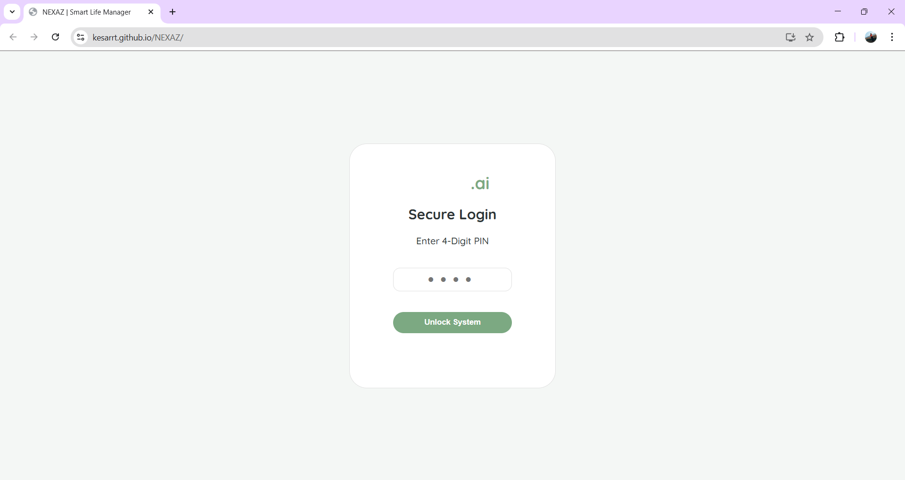
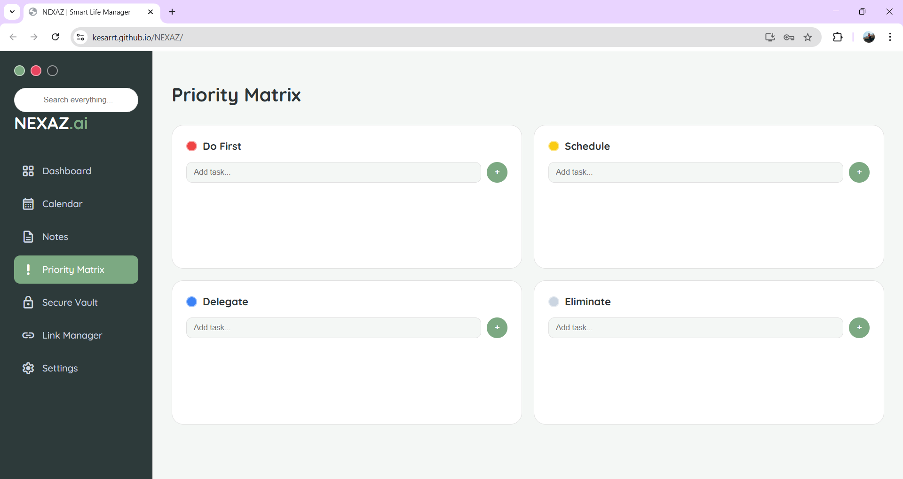
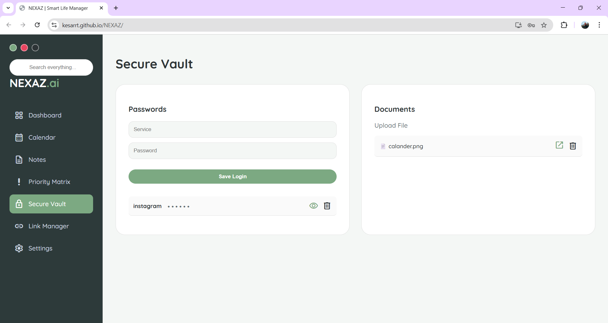
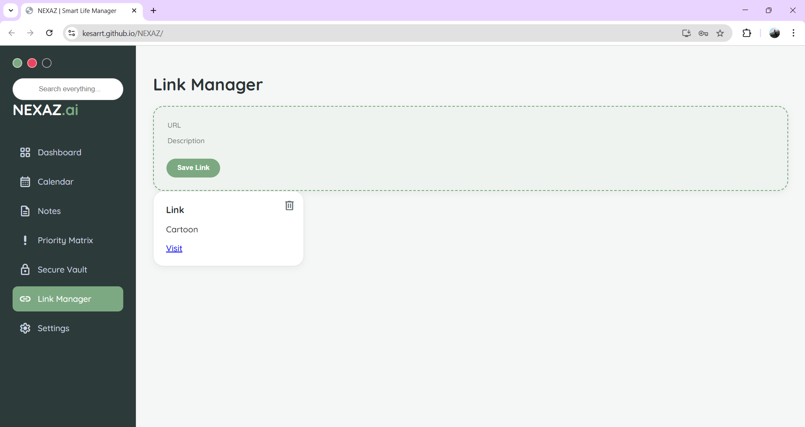
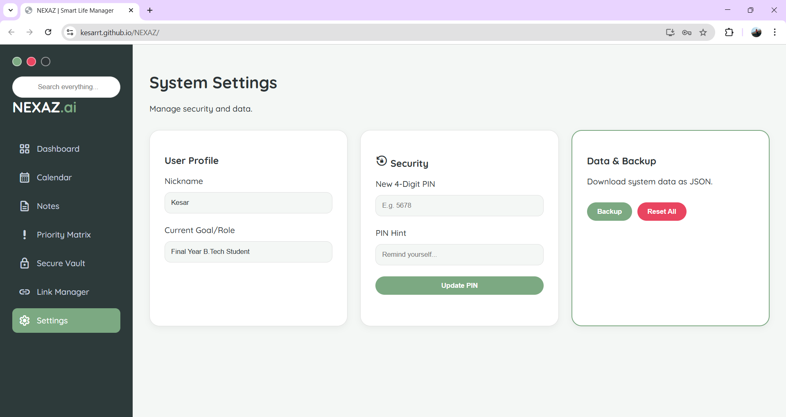

# NEXAZ | Smart Life Manager 🚀

**NEXAZ** is a secure, AI-inspired Personal OS designed for high-performance productivity, secure data storage, and streamlined scheduling. Developed as a final year project for KITS Ramtek.

### 🌐 Live Demo
Access your personal dashboard here:  
👉 **[https://kesarrt.github.io/NEXAZ/](https://kesarrt.github.io/NEXAZ/)**

---

## 📸 App Preview

### 1. The Secure Lock Screen
NEXAZ prioritizes your privacy. The system is protected by a 4-digit PIN with a dedicated hint system and masked entry for security.



### 2. The Smart Dashboard & Calendar
Manage your profile, track starred task progress, and use the dynamic visual calendar to stay on top of your schedule.


### 3. Productivity Tools
From voice-activated notes to the Eisenhower Priority Matrix, every tool is designed for clarity and speed.




### 4. Security & Management
Store sensitive logins in the Vault, manage important links, and customize your system settings.





---

## ✨ Key Features

- **🔐 Privacy-First Security:** 4-digit PIN access, masked passwords, and 100% client-side data storage.
- **🎙️ Voice-Activated Notes:** Dictate thoughts directly into the system using the Web Speech API.
- **🔍 Global Smart Search:** A unified search bar that queries across all your stored notes, tasks, and links simultaneously.
- **🎨 Persistent Themes:** Choose between custom UI modes like Serene Sage, Midnight Navy, or Nordic Light.
- **💾 Data Control:** Export your entire system state into a portable JSON file for backup and data ownership.

---

## 🛠️ Technical Stack

- **Frontend:** HTML5, CSS3 (Advanced Grid & Flexbox), JavaScript (ES6+)
- **Icons:** Google Material Symbols (Rounded)
- **Typography:** Quicksand & Montserrat
- **APIs:** Web Speech API, Web Storage API

---

## 🚀 How to use locally
1. Clone the repository:
   ```bash
   git clone [https://github.com/Kesarrt/NEXAZ.git](https://github.com/Kesarrt/NEXAZ.git)
